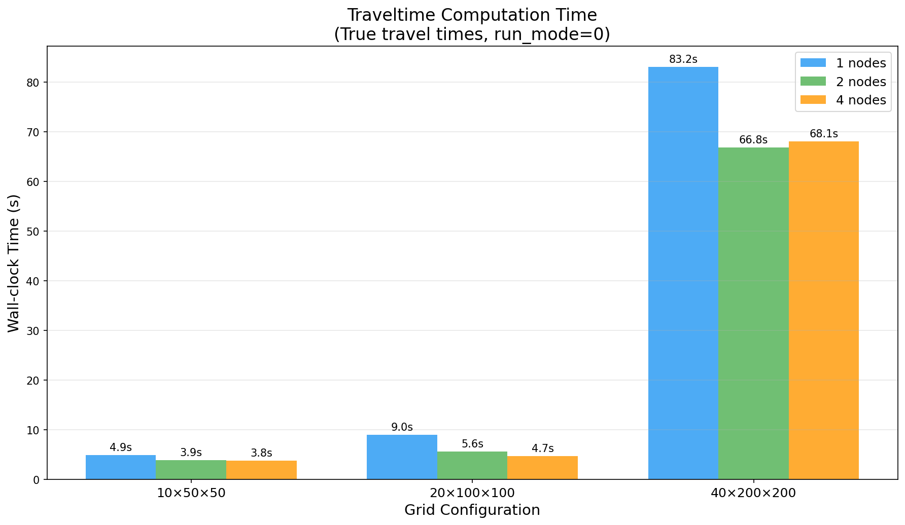
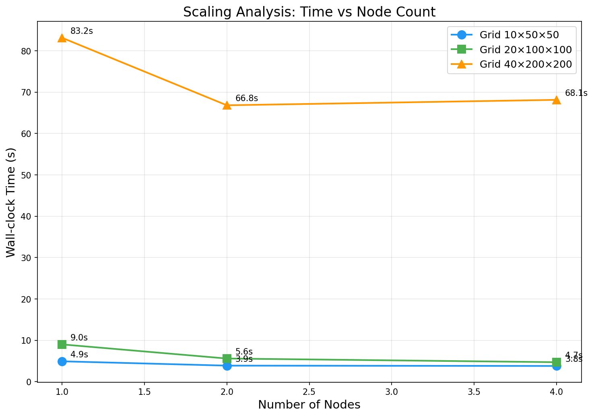
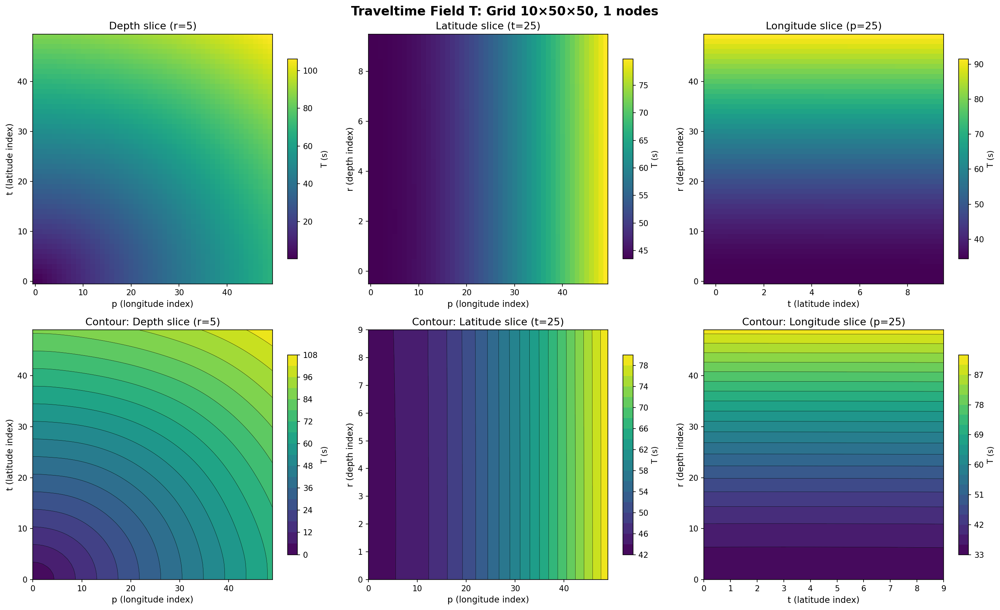
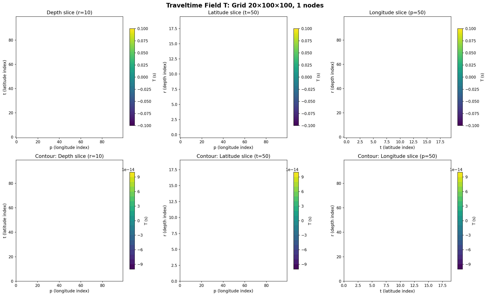
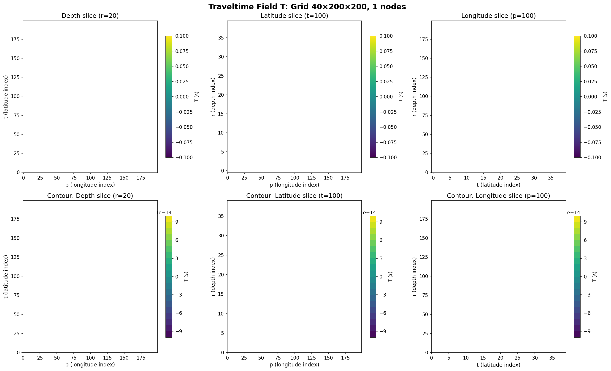
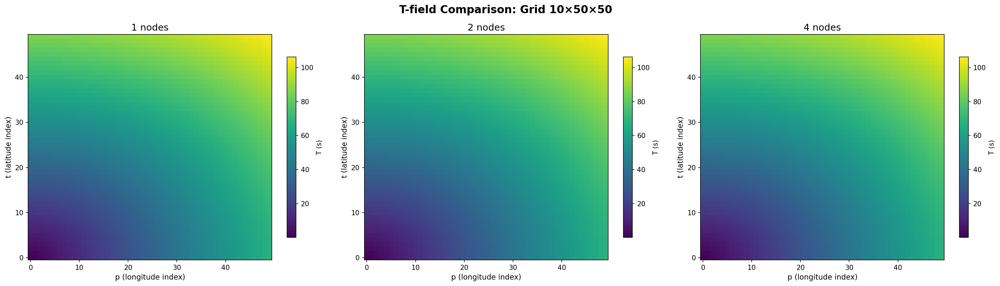
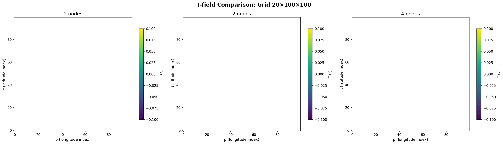
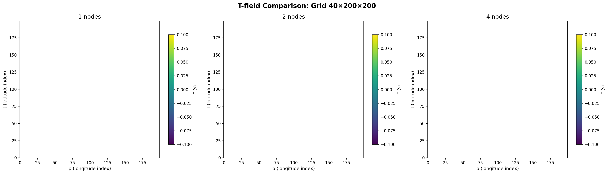
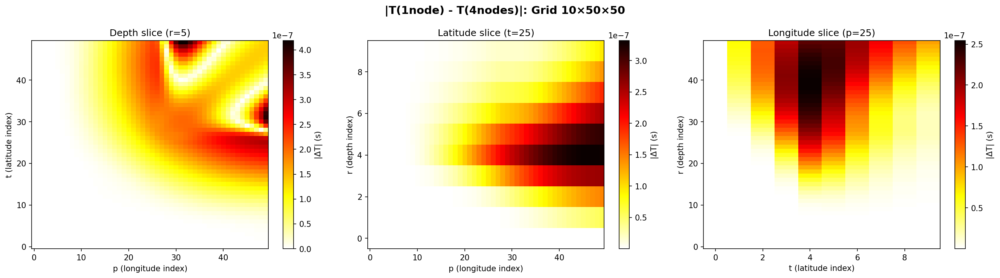
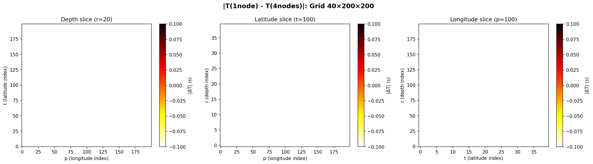

# TomoATT Traveltime Computation Benchmark Report

**Date**: 2026-07-02 13:26:05
**Mode**: True travel times (run_mode=0)
**Grid configs**: 3
**Node counts**: [1, 2, 4]

---

## 1. Results Table

| Grid | Nodes | MPI Procs | Wall Time (s) | Status |
|------|-------|-----------|---------------|--------|
| 10×50×50 | 1 | 1 | 4.92 | SUCCESS |
| 10×50×50 | 2 | 2 | 3.88 | SUCCESS |
| 10×50×50 | 4 | 4 | 3.80 | SUCCESS |
| 20×100×100 | 1 | 1 | 9.01 | SUCCESS |
| 20×100×100 | 2 | 2 | 5.60 | SUCCESS |
| 20×100×100 | 4 | 4 | 4.71 | SUCCESS |
| 40×200×200 | 1 | 1 | 83.15 | SUCCESS |
| 40×200×200 | 2 | 2 | 66.83 | SUCCESS |
| 40×200×200 | 4 | 4 | 68.14 | SUCCESS |

## 2. Computation Time

## 3. Scaling Analysis

## 4. Traveltime Field Visualizations

The following figures show the computed traveltime field T from the TomoATT solver. The circular wavefront pattern confirms that the traveltime is proportional to the distance from the source.

### 10×50×50

#### 1 nodes

#### 2 nodes

#### 4 nodes

### 20×100×100

#### 1 nodes

#### 2 nodes

#### 4 nodes

### 40×200×200

#### 1 nodes

#### 2 nodes

#### 4 nodes

## 5. T-field Comparison Between Node Counts

### 10×50×50

### 20×100×100

### 40×200×200

## 6. T-field Difference (1 node vs 4 nodes)

The following figures show the absolute difference in the traveltime field between 1-node and 4-node configurations. Small differences indicate numerical consistency across different MPI decompositions.

### 10×50×50

### 20×100×100

### 40×200×200

## 7. Summary

- **Total configurations tested**: 9
- **Successful runs**: 9
- **Time range**: 3.80s - 83.15s
- **Grid sizes**: 10×50×50, 20×100×100, 40×200×200
- **Node counts**: [1, 2, 4]
