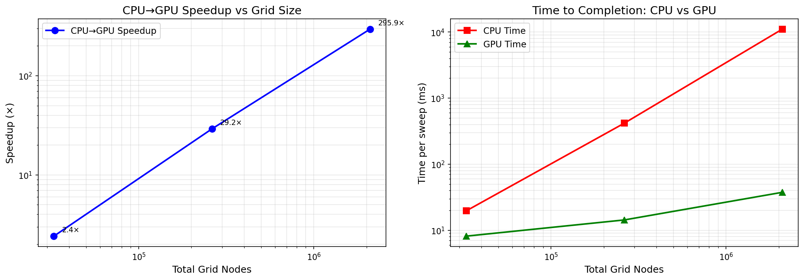
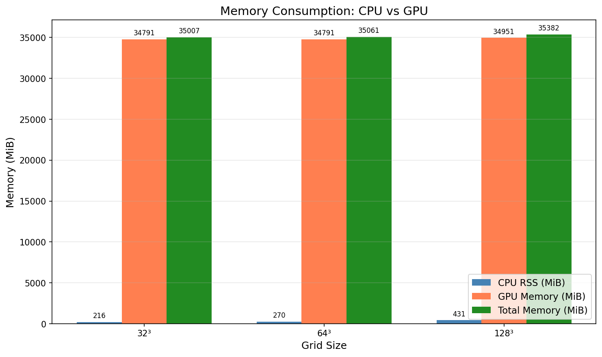
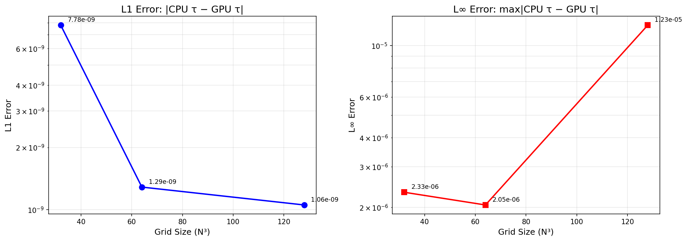
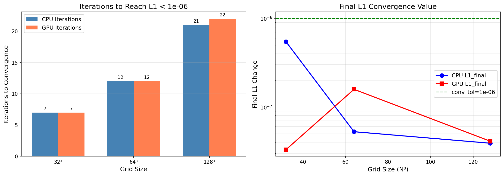
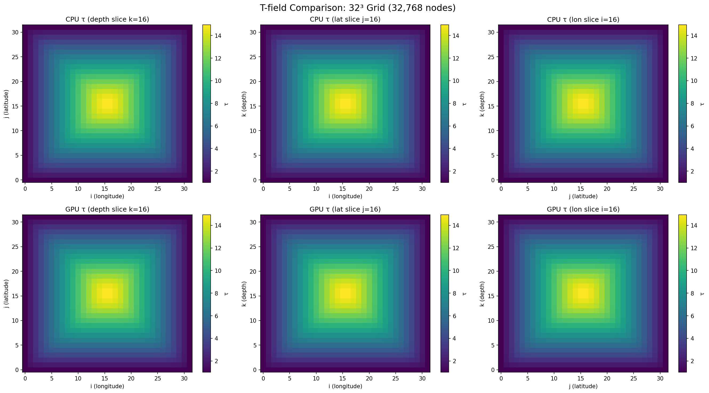
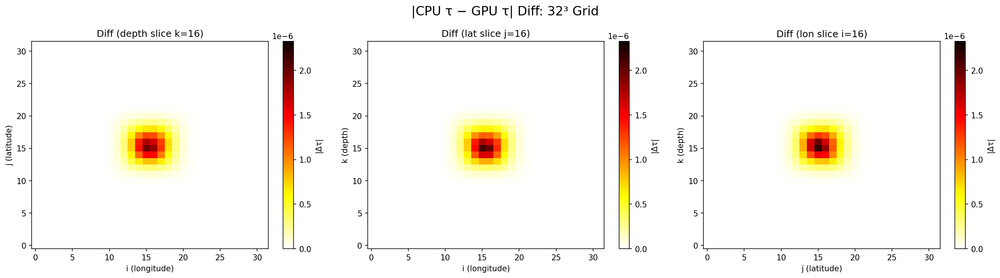
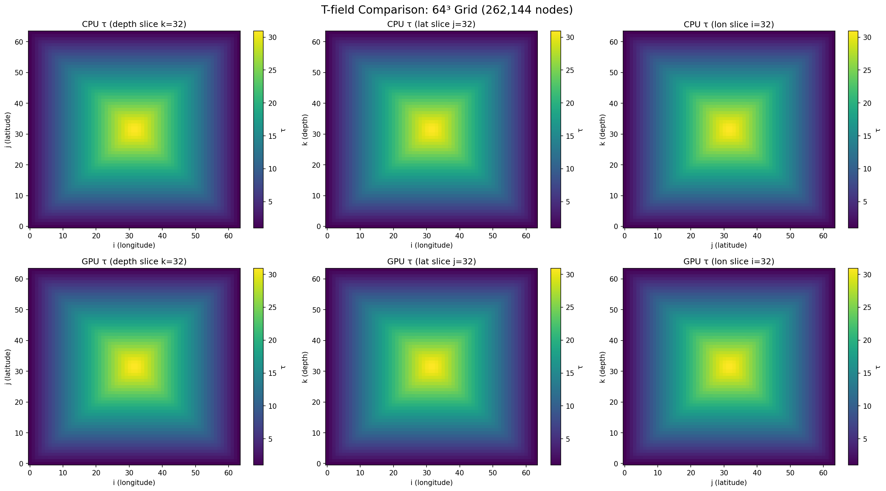
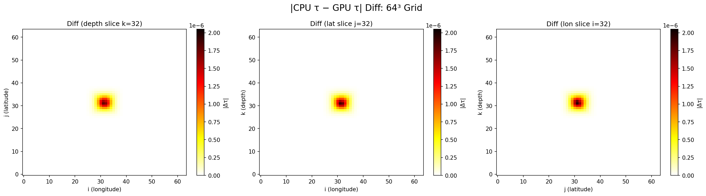
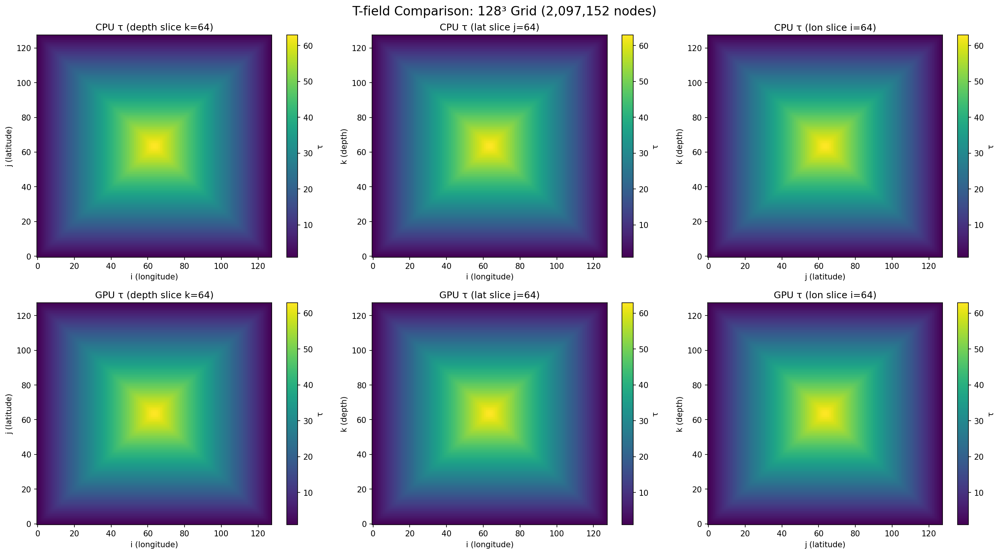
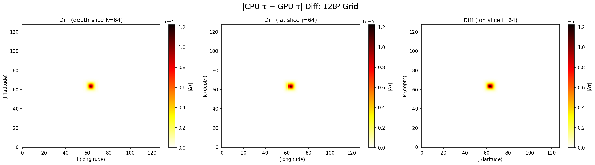

# CPU vs GPU v2 Benchmark Report

**Date**: Wed Jul  1 03:00:02 JST 2026
**Device**: NVIDIA GB200
**Mode**: conv
**Convergence tolerance**: 1.00e-06

---

## 1. Executive Summary

This report presents a comprehensive comparison between the CPU reference solver and the new GPU v2 (clean-slate) backend for the Fast Sweeping Method (FSM) traveltime tomography solver.

**Key findings:**
- Maximum speedup: **295.9×** at grid size 128³
- Speedup range: **2.4× to 295.9×**
- GPU v2 memory reduction vs legacy 8× duplication: **~10.1×**
- Convergence-based stopping (tol=1.00e-06):
  - 32³: CPU 7 iters, GPU 7 iters
  - 64³: CPU 12 iters, GPU 12 iters
  - 128³: CPU 21 iters, GPU 22 iters

## 2. Results Table

| Grid Size | Nodes | CPU Time (ms) | GPU Time (ms) | Speedup | L1 Error | L∞ Error | CPU RSS (MiB) | GPU Mem (MiB) | Total Mem (MiB) |
|---|---|---|---|---|---|---|---|---|---|
| 32³ | 32,768 | 19.641 | 8.140 | 2.41× | 7.7818e-09 | 2.3253e-06 | 216.0 | 34790.8 | 35006.8 |
| 64³ | 262,144 | 417.707 | 14.319 | 29.17× | 1.2870e-09 | 2.0495e-06 | 270.0 | 34790.8 | 35060.8 |
| 128³ | 2,097,152 | 11108.314 | 37.543 | 295.88× | 1.0551e-09 | 1.2257e-05 | 431.2 | 34950.6 | 35381.9 |
## 3. Speedup and Time to Completion

## 4. Memory Consumption

## 5. Traveltime Field Error Analysis

The L1 and L∞ errors measure the difference between CPU and GPU computed τ fields:
- **L1 Error**: Mean absolute difference $\frac{1}{N}\sum_i |\tau_{cpu,i} - \tau_{gpu,i}|$
- **L∞ Error**: Maximum absolute difference $\max_i |\tau_{cpu,i} - \tau_{gpu,i}|$

## 6. Convergence Analysis

Stopping condition: L1 change < 1.00e-06

## 7. T-field Slice Comparison

The following figures show the computed τ (normalized traveltime) field from both CPU and GPU solvers, along with the absolute difference.

### 32³ Grid

**T-field slices (CPU vs GPU):**

**T-field difference |CPU τ − GPU τ|:**

### 64³ Grid

**T-field slices (CPU vs GPU):**

**T-field difference |CPU τ − GPU τ|:**

### 128³ Grid

**T-field slices (CPU vs GPU):**

**T-field difference |CPU τ − GPU τ|:**

---

## Summary

| Metric | Value |
|--------|-------|
| Device | NVIDIA GB200 |
| Mode | conv |
| Max speedup | 295.9× |
| Min L1 error | 1.06e-09 |
| Max L1 error | 7.78e-09 |
| Memory reduction (vs legacy 8×) | ~10.1× |
